# Redux Niveau Initiation
Redux is a predictable state container for JavaScript apps.  It helps you write applications that behave consistently, run in different environments (client, server, and native), and are easy to test. On top of that, it provides a great developer experience, such as live code editing combined with a time traveling debugger.
## Plan de la formation

## Public concerné

## Connaissances requises

## Ressources & Outils 

## Redux Kezako ?

## Inspiration

## Avantage Redux

## Présentation & concepts clés

## Gestion état & cycle de vie

## Créateurs d'actions

## Fonction reducer

## Store
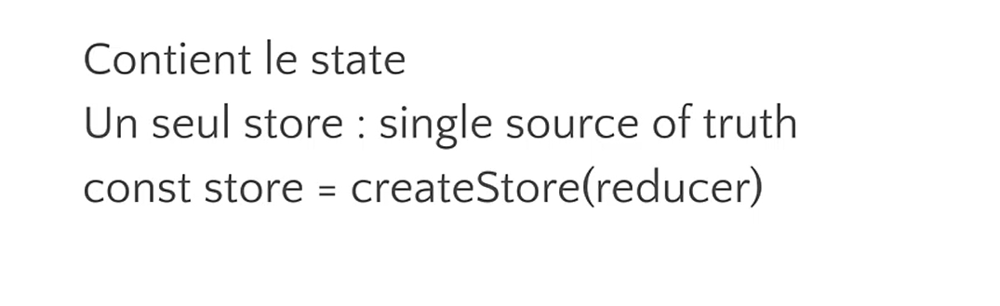
## Cycle de vie unidirectionnel
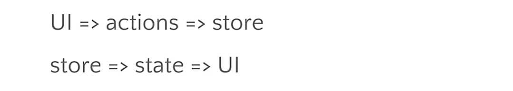
## Flux de données
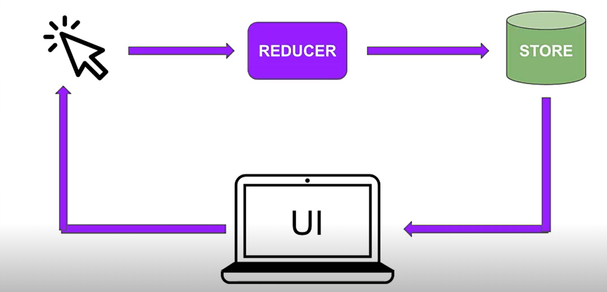
## Créer des actions
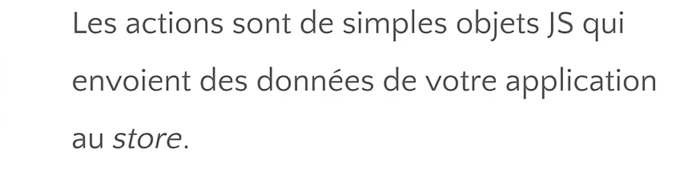
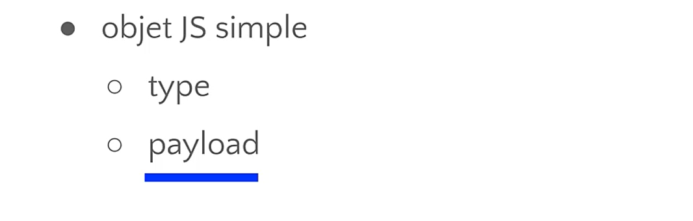
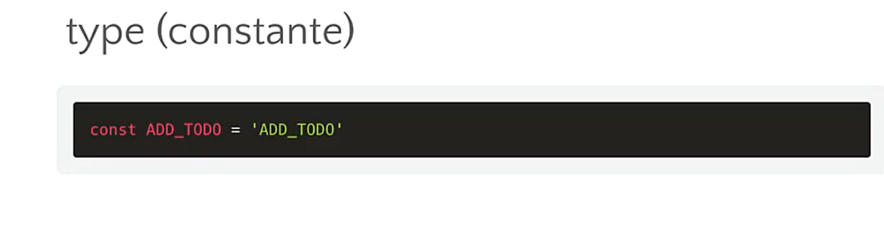
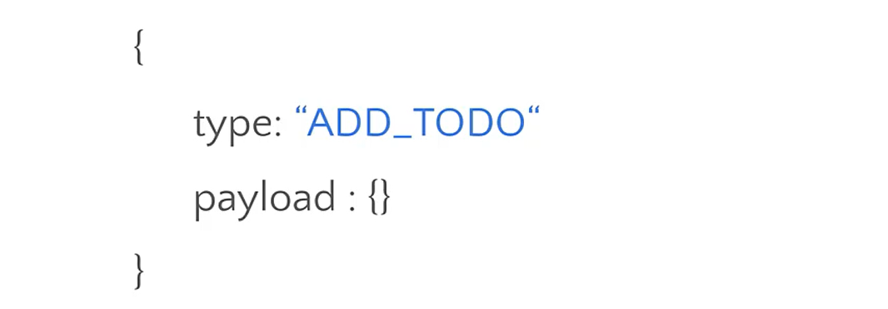
## Définir des actions
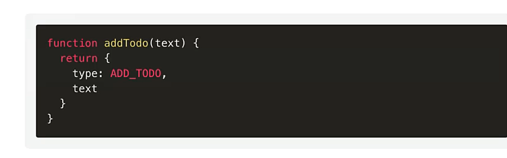
## Dispatch des actions

## Définir la fonction reducer
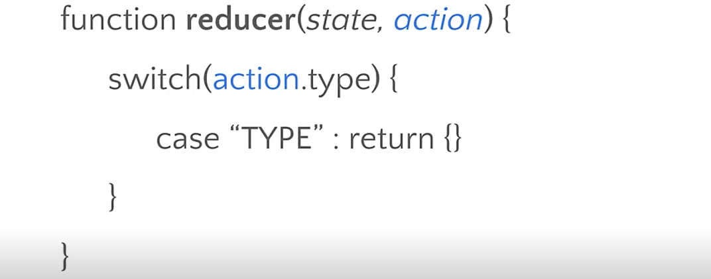
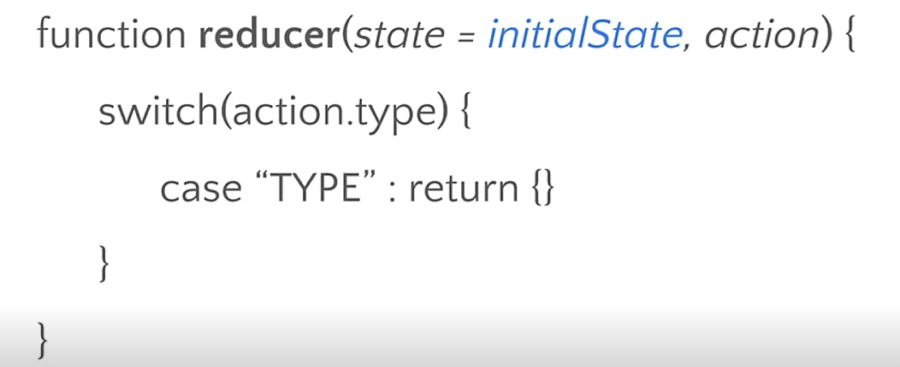
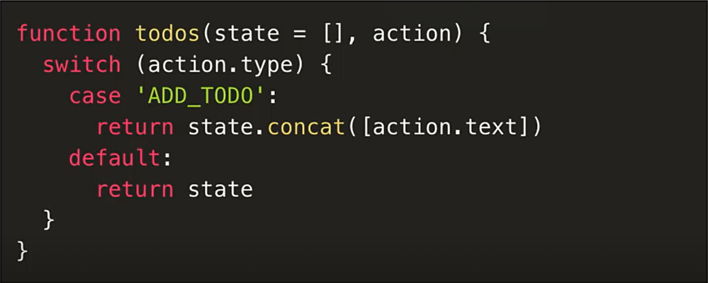
